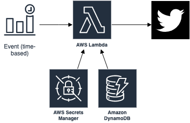

# Tweetbook Lambda

This is a toy project to learn and practice AWS and AWS-CDK. It creates an AWS stack which contains Lambda functions, DynamoDB table, EventBridge, and Secrets Manager. The main function is to read a message from DynamoDB and tweet it periodically.

    

